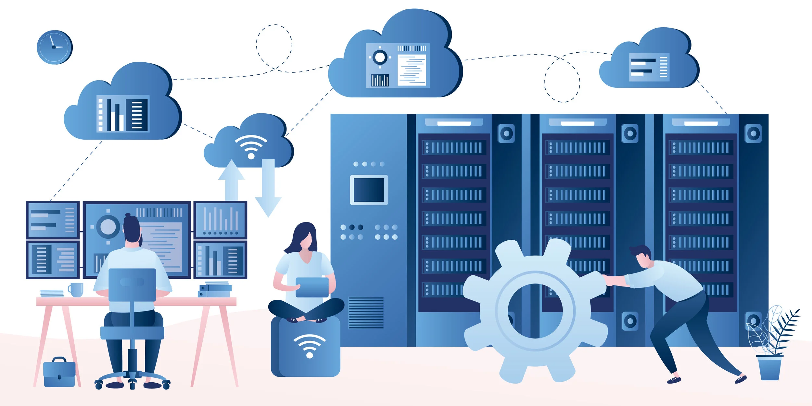

1. What image comes to mind when I think of system administration
A: in side bar

2. Describe 3 to 5 points of priorities that comes with being a system admin?
A: Making sure the system is updated like terms and conditions.
Making sure that the servers and or the pages are running smoothly 
Also making sure that valuable info or information is backed up and stored correctly for a client 

3. Who wrote this report, and what is their primary market?
The primary market for this report is people who do Inventory, security management and people who manage   
windows and other platforms like mac os and linux

The person or people that have write this report would be people that would be inside of a IT department people that   
realese software tools for the system administators

4. Who were the respondees to this survey?

people with 10+ years of exprience in this specific field

5. Draw two conclusions from the Demographics section - use bullet points in markdown
The demograhpics show that these are people that have expeirence in this field hands on It profesionals not just
beginners who just put their foot in the door 

The people that are responding to this is people who work in the health department the education department and the technology department 

6. Find a resource that describes IT salaries for the Dayton Area.
According to salary.com the entry level postion would be around 64k dollars rounded up then a senior postion with
more expirence under his or her belt would be around 94k dollars. 
https://www.salary.com/research/salary/listing/it-technician-salary/dayton-oh

7. What is you sentiment on the IT field based on the Sentiment notes given in the report?

Given in the report people are stressed in this field because of the high demand and also things and machines are changing all the time.

8. Of the top time consuming tasks, which do you think are best suited for and why?

patch management automation is the best way to go, because of the rising demand in AI people need to make sure that servers and other things have no holes and or no spots the AI can just hack and get into

9. How many devices do you currently manage?
I currently manage my pc, phone, ps5, ps portal and xbox and switch. So 6 pieces of equipment 

10. Detail all cybersecurity training you have had.

All the cybersecurity traing I have had perosnally. I have a certifaicate that is partially done called the 
cybersecutiy anaylst
 course licened by google
 https://www.coursera.org/career-academy/roles/cyber-security-analyst?

11. What kind of advice have you give out that would be cybersecurity oriented?

the advice I would give to people that is cyber related? make sure that your pc or whatever piece of tech you have is updated so nothing can hack your stuff. Be organzied cybersecurity requires organzization.

12. Find a resource that describes market share of operating systems for server tasks.

https://www.fortunebusinessinsights.com/server-operating-system-market-106601

13. Find a resource that describes market share of operating systems for employee computers.

https://gs.statcounter.com/os-market-share

14. What conclusions can you draw?

If you want to start your own server. Like your own home server or wherever you want your server to be put it on linux because linux is good for stability and low risk 

15. Pick two three tools from the report that you would like to get experience with for resume building and why you think they would be a boost.
 
Pdq deploy. I have never heard of the platform and it is cool, really useful you can see so much information about your server all in one place no need to shop around to find a certain info block about... cooling or example 

Microsofts intune platform this is used to sercure your devices from threats. Like a VPN (virtual private network)

